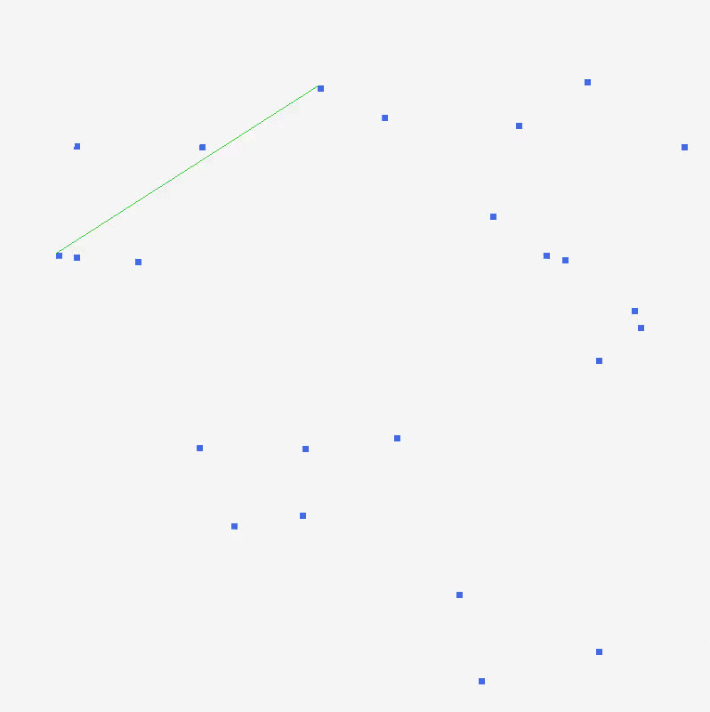

## Graham Scan for computing 2D convex hull

In this project, you need to implement Graham Scan algorithm for computing 2D convex hull.

Here are two demos:


source: [wikipedia](https://en.wikipedia.org/wiki/Graham_scan)



source: personal implementation

Note that the second demo is in a right-turning fashion.

#### Inside the ```proj2```

-   ```make``` to build
-   ```make test TEST_FILE=filename``` to run test, valid test files are:
    -   ```points1.txt```
    -   ```points2.txt```
    -   ```points3.txt```
    -   ```points4.txt```
    -   ```points5.txt```
-   ```make clean``` to clean the executable file (```myexec```).
-   ```make cleanall``` also clean the ```res_*.txt``` files.
-   in ```proj2/test/```, there are five text files that contain the input data samples.
-   in ```proj2/results_figs```, there are five images showing the results.
-   ```plotting.m``` is a MATLAB/Octave plotting script (Python version will come shortly).
